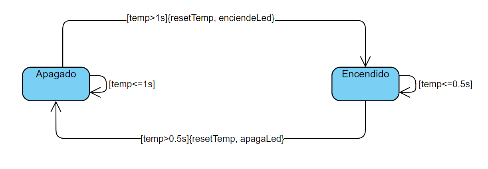

# Ejemplo de maquina de estados

Comienza apagada si el temporizador es mayor de 1s, enciende el led y va al estado encendido, reiniciando el contador.
Cuando medio segundo apaga el led, va al estado apagado y reinicia el temporizador.